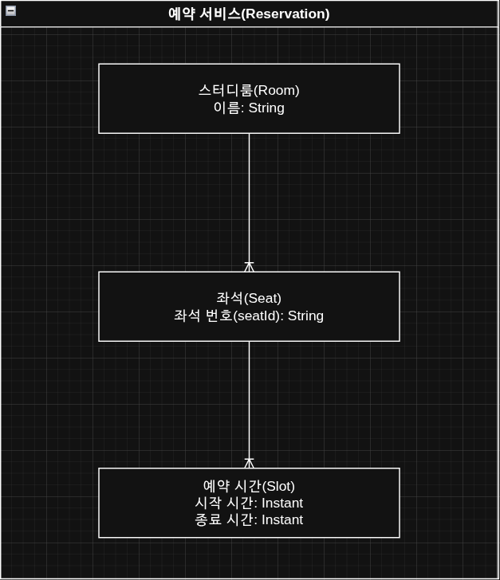

예약 좌석 관리하는 서비스이에요
한 사람 당 예약 하나만 됨.
예약은 시작 시간, 종료 시간을 갖고 있는데, 좌석에 존재하는 예약 시간들끼리는 시간 구간이 겹치면 안댐
\[startTime, endTime)

### ERD 테이블 ㅋㅋ


## API 목록들

### 좌석 예약

- 좌석을 예약하는거에용

`POST /reservation`

**RequestBody**

```json
{
  "userId": "string",
  "roomId": "string",
  "seatId": "string",
  "startTime": "datetime",
  "endTime": "datetime"
}
```

**ResponseBody**

```json
{
  "success": "boolean"
}
```

**`200 OK` Example**

```json
{
  "success": "true"
}
```

**`400 BadRequest` Example**

```json
{
  "success": "false"
}
```

### 좌석 예약 취소

- 좌석 예약한거 취소하는거에용

`DELETE /reservation`

**RequestBody**

```json
{
  "userId": "boolean"
}
```

**ResponseBody**

```json
{
  "success": "boolean"
}
```

**`200 OK` Example**

```json
{
  "success": "true"
}
```

**`400 BadRequest` Example**

```json
{
  "success": "false"
}
```

### 예약 수정

- 자기가 예약한거 (아직 이용하는 건 아님 ㅋㅋ) 시간 같은거 바꾸는거에요

`PATCH /reservation`

```json
{
  "userId": "string",
  "roomId": "string",
  "seatId": "string",
  "startTime": "datetime",
  "endTime": "datetime"
}
```

**`200 OK` Example**

```json
{
  "success": "true"
}
```

**`400 BadRequest` Example**

```json
{
  "success": "false"
}
```

// 아래는 안할꺼임 지금은

### 시간 연장

- 이미 이용하고 있는데 시간 늘리는거에요

```json
{
  "userId": "string",
  "endTime": "datetime"
}
```

**`200 OK` Example**

```json
{
  "success": "true"
}
```

**`400 BadRequest` Example**

```json
{
  "success": "false"
}
```
