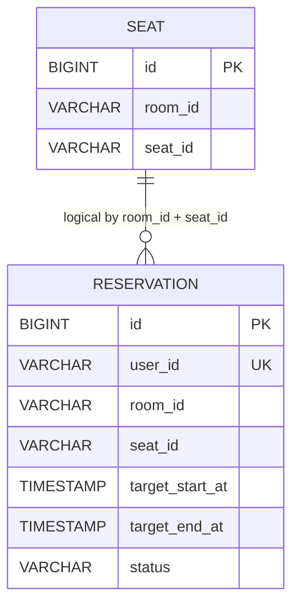
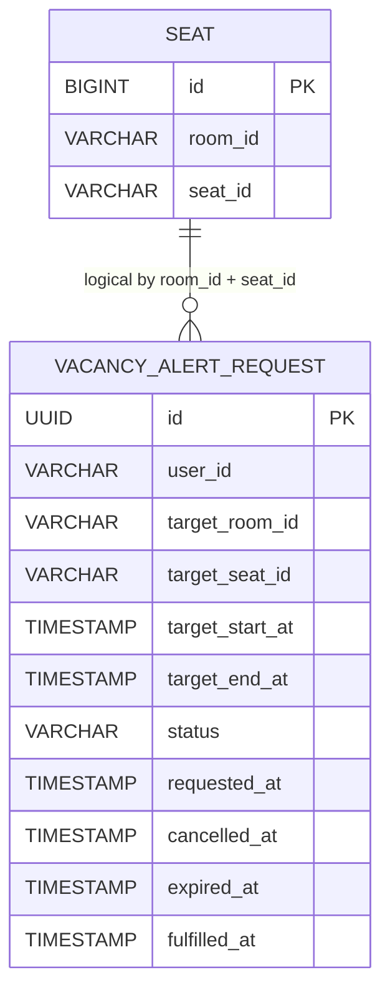
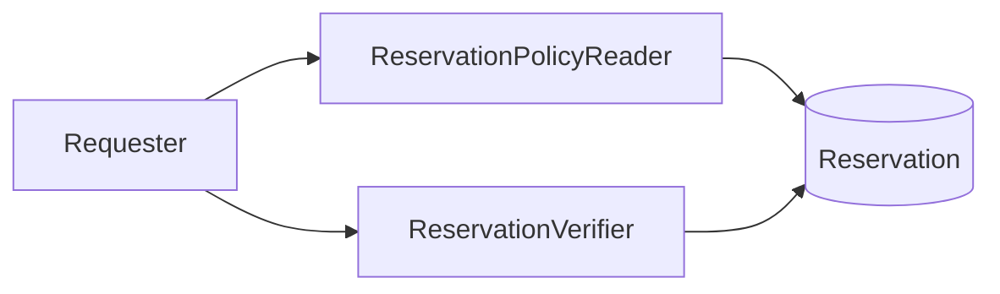

# Reservation Application

`reservation:reservation-application` 모듈은 좌석 예약, 빈자리 알림, 예약 검증 정책과 예약 취소 이후의 빈자리 알림 생성 연계 흐름을 담당하는 Spring Boot 기반
애플리케이션입니다.

패키지는 기능 단위로 `book`, `vacancy`, `verification` 으로 분리되어 있고, 좌석/시간 범위와 이벤트 같은 공통 모델은 `shared` 패키지에서 재사용합니다.

## 개요

| 기능             | 설명                           | 외부 노출 방식  |
|----------------|------------------------------|-----------|
| `book`         | 좌석 생성/수정/삭제, 예약 생성/수정/취소     | REST API  |
| `vacancy`      | 특정 좌석/시간대에 대한 빈자리 알림 신청 및 취소 | REST API  |
| `verification` | 예약 조회 권한 확인, 예약 사용 처리 정책 검증  | 애플리케이션 포트 |

## 패키지 구성

| 패키지                                                        | 역할                                                     |
|------------------------------------------------------------|--------------------------------------------------------|
| `com.seatliberator.seatliberator.reservation.book`         | `Seat`, `Reservation` 도메인과 예약/좌석 관리 유스케이스              |
| `com.seatliberator.seatliberator.reservation.shared`       | `SeatLocator`, `TimeRange`, domain event 등 예약/알림 공통 모델 |
| `com.seatliberator.seatliberator.reservation.vacancy`      | 빈자리 알림 요청 도메인과 알림 신청/취소 유스케이스                          |
| `com.seatliberator.seatliberator.reservation.verification` | 예약 조회/검증 권한 정책, 사용 처리 유스케이스                            |

## 핵심 정책

- 한 사용자는 동시에 하나의 예약만 가질 수 있습니다. `Reservation.userId` 에 유니크 제약이 있습니다.
- 같은 좌석의 예약 시간은 서로 겹칠 수 없습니다. 시간 구간은 `[startTime, endTime)` 규칙으로 처리됩니다.
- 예약 생성/수정 시 대상 좌석은 반드시 존재해야 합니다.
- 모든 REST API는 인증이 필요하며, 사용자 식별자는 JWT로부터 `ActorContextHolder` 에 바인딩된 actor subject를 사용합니다.
- 예약 사용 처리 시 이미 사용된 예약은 다시 사용할 수 없고, 종료 시각 이후에는 `EXPIRED` 로 전이됩니다.
- 예약 취소가 성공하면 `Reservation` 은 `CANCELED` 로 전이되고 `ReservationCanceled` 도메인 이벤트를 발행합니다.
- 빈자리 알림은 동일한 `(userId, roomId, seatId, targetStartTime, targetEndTime)` 조합에 대해 `ACTIVE` 상태 중복 등록이 불가능합니다.
- 예약 취소 이벤트를 받으면 같은 좌석이고 시간이 겹치는 `ACTIVE` 빈자리 알림 요청만 조회합니다.
- 조회된 요청마다 `NOTIFICATION_CREATE_REQUEST` 이벤트를 발행하고, 해당 요청은 `FULFILLED` 로 전이됩니다.
- 취소된 빈자리 알림은 동일 조건으로 다시 등록할 수 있습니다.

## 빈자리 알림 생성 흐름

예약 취소와 빈자리 알림 생성은 직접 결합하지 않고, `ReservationCanceled` 도메인 이벤트를 통해 연결합니다.

| 단계           | 설명                                                                                                                                                                                  |
|--------------|-------------------------------------------------------------------------------------------------------------------------------------------------------------------------------------|
| 1. 빈자리 알림 신청 | 사용자가 좌석/시간대 기준으로 `VacancyAlertRequest` 를 생성합니다. 초기 상태는 `ACTIVE` 입니다.                                                                                                                |
| 2. 예약 취소     | 예약이 취소되면 `Reservation` 이 `CANCELED` 로 전이되고 `ReservationCanceled(locator, range, canceledAt)` 이벤트가 발생합니다.                                                                            |
| 3. 대상자 조회    | `ReservationCanceledHandler` 가 같은 좌석이고 시간 구간이 겹치는 `ACTIVE` 요청만 조회합니다. 시간 겹침 판별은 `[start, end)` 기준으로 `request.start < reservation.end && request.end > reservation.start` 조건을 사용합니다. |
| 4. 알림 생성 연결  | 각 요청에 대해 notification 모듈의 `NOTIFICATION_CREATE_REQUEST` 이벤트를 발행하고, 요청 상태를 `FULFILLED` 로 전이합니다.                                                                                      |

현재 구현 기준으로 다음 요청은 알림 대상에서 제외됩니다.

- 이미 `CANCELLED`, `EXPIRED`, `FULFILLED` 상태인 요청
- 다른 좌석에 대한 요청
- 시간대가 겹치지 않는 요청

상세 시나리오와 도메인 정의는 [docs/VACANCY_ALERT_CANCEL_FLOW.md](docs/VACANCY_ALERT_CANCEL_FLOW.md) 에 정리되어 있습니다.

## API

현재 이 모듈에는 `book`, `vacancy` 패키지에 대한 REST 컨트롤러만 존재합니다. `verification` 은 내부 애플리케이션 포트로만 노출됩니다.

현재 `SecurityConfiguration` 기준으로 모든 API는 인증이 필요합니다.

성공 응답은 컨트롤러에 명시되어 있지만, 예외 응답 형식은 이 모듈 내부에 별도 `@ControllerAdvice` 가 정의되어 있지 않습니다.

### Book API

#### Seat API

| Method   | Path                      | 설명        |
|----------|---------------------------|-----------|
| `POST`   | `/seat`                   | 좌석 생성     |
| `PUT`    | `/seat`                   | 좌석 식별자 변경 |
| `DELETE` | `/seat/{roomId}/{seatId}` | 좌석 삭제     |

**`POST /seat`**

```json
{
  "roomId": "room-1",
  "seatId": "seat-1"
}
```

성공 응답:

```json
{
  "success": true
}
```

**`PUT /seat`**

```json
{
  "oldRoomId": "room-1",
  "oldSeatId": "seat-1",
  "newRoomId": "room-1",
  "newSeatId": "seat-2"
}
```

성공 응답:

```json
{
  "success": true
}
```

설명:

- 생성/수정 시 동일한 `(roomId, seatId)` 가 이미 존재하면 `false` 를 반환합니다.
- 삭제는 존재 여부를 별도로 확인하지 않고 처리 후 `true` 를 반환합니다.

#### Reservation API

| Method   | Path           | 설명           |
|----------|----------------|--------------|
| `POST`   | `/reservation` | 예약 생성        |
| `PUT`    | `/reservation` | 예약 수정        |
| `DELETE` | `/reservation` | 현재 사용자 예약 취소 |

시간 필드는 `Instant` 로 매핑되므로 요청 본문에는 UTC ISO-8601 문자열을 사용합니다.

**`POST /reservation`**

```json
{
  "roomId": "room-1",
  "seatId": "seat-1",
  "startAt": "2025-06-01T01:00:00Z",
  "endAt": "2025-06-01T02:00:00Z"
}
```

성공 응답:

```json
{
  "reservationId": 1,
  "actorId": "user-1",
  "roomId": "room-1",
  "seatId": "seat-1"
}
```

**`PUT /reservation`**

```json
{
  "roomId": "room-1",
  "seatId": "seat-2",
  "startAt": "2025-06-01T01:30:00Z",
  "endAt": "2025-06-01T02:30:00Z"
}
```

성공 응답:

```json
{
  "reservationId": 1,
  "actorId": "user-1",
  "roomId": "room-1",
  "seatId": "seat-2"
}
```

**`DELETE /reservation`**

성공 응답:

```json
{
  "reservationId": 1,
  "actorId": "user-1",
  "roomId": "room-1",
  "seatId": "seat-1"
}
```

설명:

- `userId` 는 요청 본문이 아니라 인증된 actor에서 가져옵니다.
- 예약 생성은 동일 사용자의 기존 예약이 있으면 `BookApplicationException(RESERVATION_ALREADY_EXISTS)` 를 던집니다.
- 예약 생성/수정은 동일 좌석의 겹치는 시간대 예약이 있으면 `BookApplicationException(RESERVATION_TIME_CONFLICT)` 를 던집니다.
- 예약 생성/수정은 `startAt < endAt` 이어야 합니다.
- 예약 생성/취소/수정 시 좌석 조회에는 비관적 락이 사용됩니다.
- 예약 취소 대상이 없으면 `BookApplicationException(RESERVATION_NOT_FOUND)` 가 발생합니다.
- 예약 취소가 성공하면 `ReservationCanceled` 이벤트가 발행되고 후속 빈자리 알림 생성 흐름이 연결될 수 있습니다.

### Vacancy API

| Method   | Path                       | 설명        |
|----------|----------------------------|-----------|
| `POST`   | `/vacancy-alert`           | 빈자리 알림 신청 |
| `DELETE` | `/vacancy-alert/{alertId}` | 빈자리 알림 취소 |

**`POST /vacancy-alert`**

```json
{
  "roomId": "room-1",
  "seatId": "seat-1",
  "startAt": "2025-06-01T01:00:00Z",
  "endAt": "2025-06-01T02:00:00Z"
}
```

응답:

- `200 OK`
- 응답 본문 없음

**`DELETE /vacancy-alert/{alertId}`**

응답:

- `204 No Content`

설명:

- `userId` 는 요청 본문이나 헤더가 아니라 인증된 actor에서 가져옵니다.
- 알림 신청 시 `startAt < endAt` 이어야 합니다.
- 알림 신청 시 `startAt` 은 요청 시각보다 미래여야 합니다.
- 동일한 활성 알림을 중복 등록하면 `VacancyApplicationException(RVC001)` 이 발생합니다.
- 알림 취소는 본인만 가능합니다.
- 존재하지 않는 알림 취소 시 `VacancyApplicationException(RVC002)` 이 발생합니다.

### Verification 기능

`verification` 패키지에는 현재 REST 컨트롤러가 없습니다. 대신 다른 모듈 또는 상위 계층에서 호출할 수 있는 애플리케이션 포트를 제공합니다.

| 포트                                                 | 설명                                 |
|----------------------------------------------------|------------------------------------|
| `ReservationPolicyReader.read(locator, requester)` | 예약 조회 가능 여부를 검증한 뒤 예약 정보를 반환       |
| `ReservationVerifier.verify(locator, requester)`   | 예약 사용 가능 여부를 검증한 뒤 예약을 `USED` 로 전이 |

#### 지원 Locator

| 타입                            | 설명              |
|-------------------------------|-----------------|
| `IdBasedReservationLocator`   | 예약 ID 기준 조회     |
| `SeatBasedReservationLocator` | 좌석과 시간 범위 기준 조회 |

`SeatBasedReservationLocator` 는 전달된 시간 범위를 완전히 포함하는 예약을 찾습니다.

#### Requester 정책

| RequesterType | 조회 권한     | 사용 처리 권한 |
|---------------|-----------|----------|
| `USER`        | 본인 예약만 가능 | 불가       |
| `ADMIN`       | 가능        | 가능       |
| `SYSTEM`      | 가능        | 가능       |

#### 상태 전이

`Reservation.status`

- `RESERVED`: 생성 직후 상태
- `USED`: 정상 사용 처리된 상태
- `CANCELED`: 취소 처리된 상태. 이때 `ReservationCanceled` 이벤트가 발생할 수 있습니다.
- `EXPIRED`: 종료 시각 이후 사용 시도 시 전이되는 상태

## ERD

이 모듈의 JPA 엔티티는 `Seat`, `Reservation`, `VacancyAlertRequest` 세 개입니다.

중요:

- `Reservation`, `VacancyAlertRequest` 는 `Seat` 를 문자열 컬럼(`roomId`, `seatId`)로 참조합니다.
- 즉, 아래 관계는 도메인 관점의 논리 관계이며 DB 레벨 외래 키는 현재 없습니다.

### Book ERD



제약:

- `seat(room_id, seat_id)` 유니크
- `reservation.user_id` 유니크
- 동일 좌석의 예약 시간 겹침은 애플리케이션 쿼리로 방지

### Vacancy ERD



제약:

- 활성 상태의 동일 요청은 `(user_id, room_id, seat_id, target_start_time, target_end_time)` 기준 중복 저장 불가
- 상태는 `ACTIVE`, `CANCELLED`, `EXPIRED`, `FULFILLED`

### Verification ERD

`verification` 패키지는 별도 영속 엔티티를 가지지 않습니다. `Reservation` 도메인을 읽고 정책을 적용하는 서비스 계층입니다.



## 실행 설정

이 모듈은 PostgreSQL 과 Spring Data JPA 를 사용합니다.

주요 설정:

| 속성                                        | 설명                |
|-------------------------------------------|-------------------|
| `spring.datasource.url`                   | PostgreSQL 연결 URL |
| `spring.datasource.username`              | DB 사용자            |
| `spring.datasource.password`              | DB 비밀번호           |
| `spring.jpa.hibernate.ddl-auto`           | 현재 `update`       |
| `spring.jpa.properties.hibernate.dialect` | PostgreSQLDialect |

필수 환경 변수:

| 환경 변수         | 설명             |
|---------------|----------------|
| `DB_HOST`     | DB 호스트         |
| `DB_PORT`     | DB 포트          |
| `DB_SCHEMA`   | DB 스키마/데이터베이스명 |
| `DB_USERNAME` | DB 사용자         |
| `DB_PASSWORD` | DB 비밀번호        |

## 참고

- 기존 [`docs/SPEC.md`](docs/SPEC.md) 는 초안이며, 현재 README 는 실제 구현 코드를 기준으로 정리했습니다.
