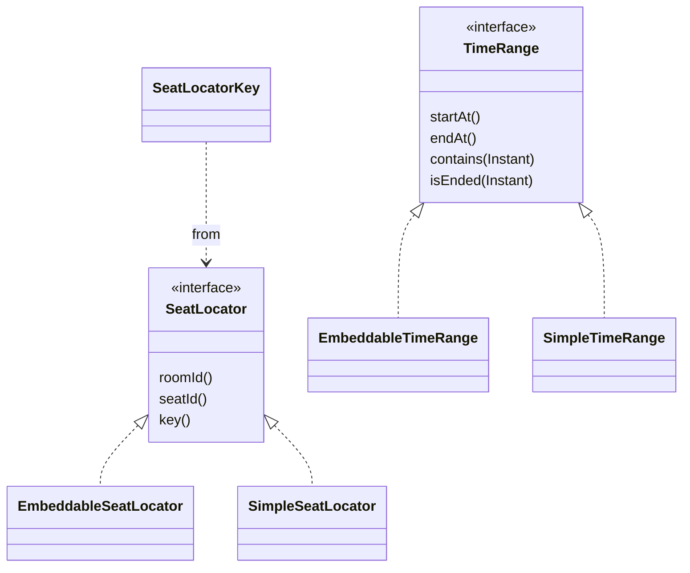
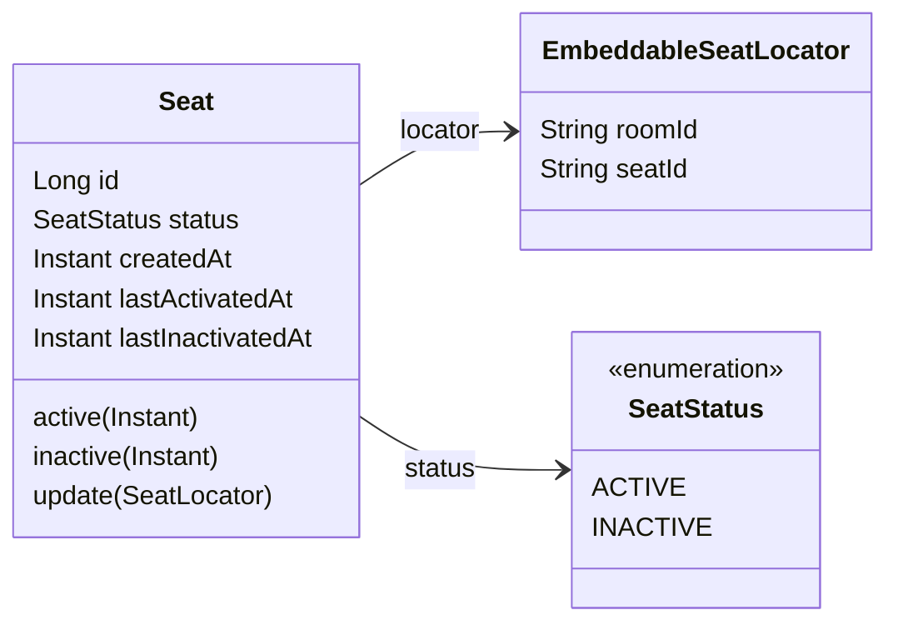
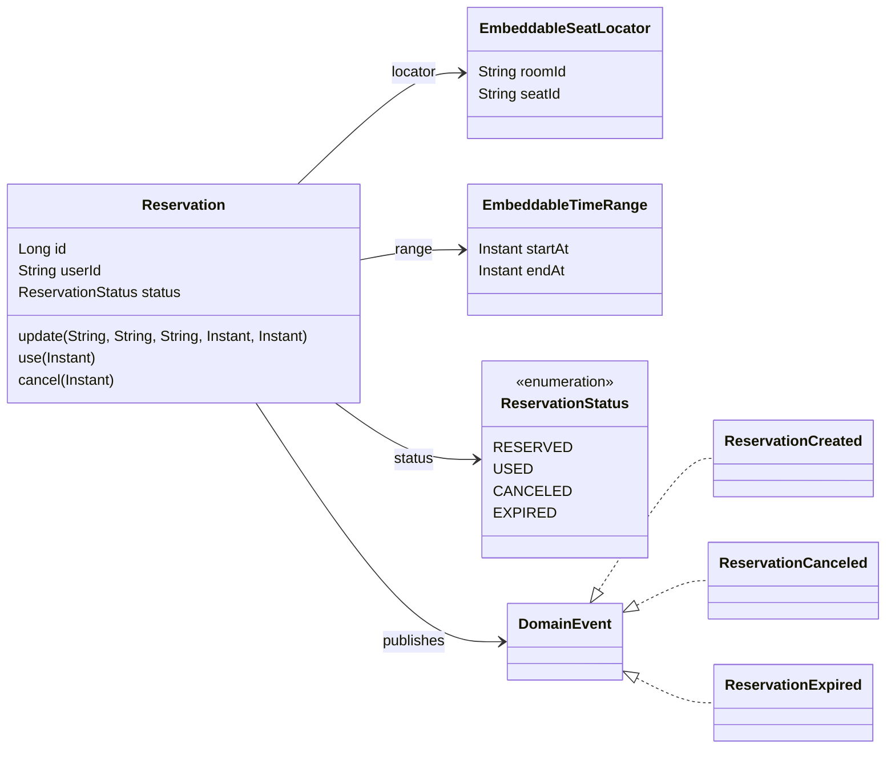
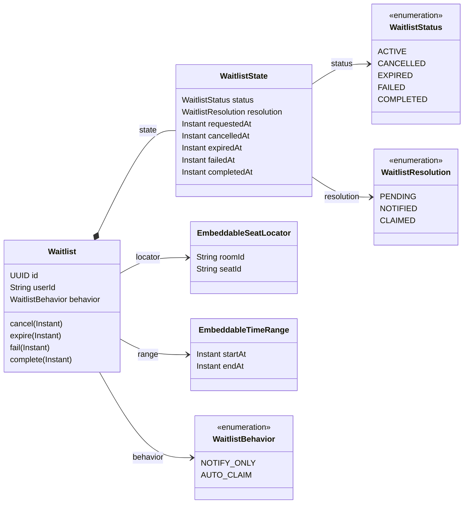
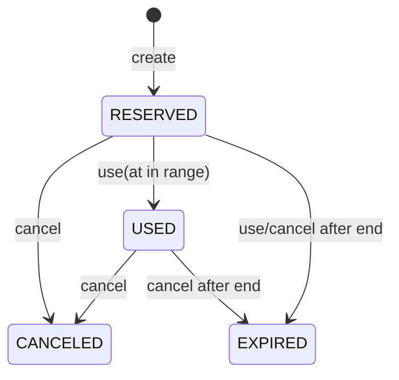
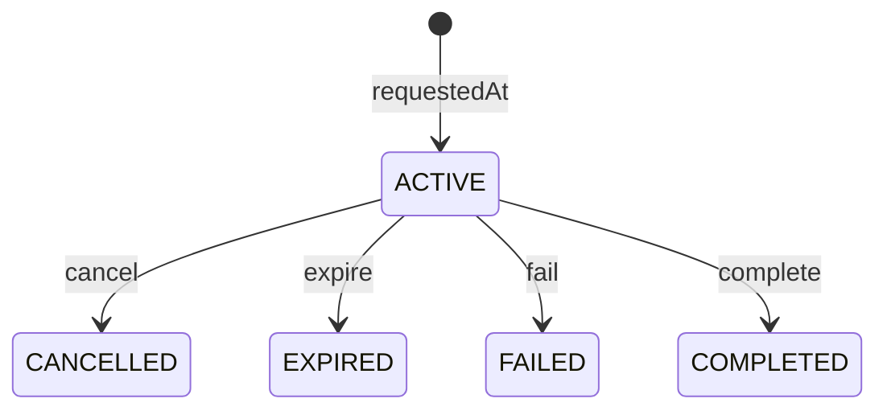

# Reservation Domain

`reservation:reservation-domain`은 예약 도메인의 엔티티, 값 객체, 상태 enum, 도메인 이벤트를 담는 Java 모듈입니다.

이 모듈은 HTTP, persistence adapter, 외부 API 연동을 직접 다루지 않습니다. 다만 JPA entity와 embeddable 타입을 포함하므로 application 모듈의 JPA adapter가 이 도메인 타입을 저장 단위로 사용합니다.

## 모듈 개요

주요 책임은 다음과 같습니다.

- 좌석 식별자와 시간 범위 값 객체 정의
- 좌석, 예약, 대기열 엔티티의 상태와 전이 규칙 보유
- 예약 생성/취소/만료 도메인 이벤트 정의
- 테스트 fixture 제공

## 빌드 구성

`build.gradle.kts` 기준 구성은 다음과 같습니다.

- plugin: `java`
- plugin: `java-test-fixtures`
- 내부 의존성: `:kernel`
- persistence annotation 의존성: `spring-boot-starter-data-jpa`
- compile-only 의존성: `lombok`
- test fixture 의존성: `assertj-core`, `jakarta.persistence-api`

모듈 단위 테스트는 다음 명령으로 실행합니다.

```bash
./gradlew :reservation:reservation-domain:test
```

## 패키지 구조

- `reservation.domain`: 값 객체 계약, simple/embeddable 구현, 상태 enum
- `reservation.domain.persistence`: JPA entity와 embeddable 상태 객체
- `reservation.domain.event`: 예약 도메인 이벤트
- `reservation.domain.validator`: 대기열 상태 불변식 검증
- `src/testFixtures`: application 모듈에서도 재사용하는 도메인 테스트 fixture

## 도메인 관계

GitHub Markdown은 Mermaid 다이어그램을 렌더링합니다. 도메인 관계는 관심사별로 나누어 표현합니다.

### 값 객체

좌석 식별자와 시간 범위는 인터페이스 계약을 기준으로 simple 구현과 JPA embeddable 구현을 분리합니다.



### 좌석

`Seat`는 좌석 식별자와 활성 상태를 보유합니다.



### 예약

`Reservation`은 좌석/시간 범위와 예약 상태를 가지며, 생성/취소/만료 이벤트를 등록합니다.



### 대기열

`Waitlist`는 대상 좌석/시간 범위와 처리 방식을 가지며, 실제 상태 불변식은 `WaitlistState`가 담당합니다.



## 주요 모델

### Seat

`Seat`는 방과 좌석 ID로 식별되는 물리 좌석입니다.

- `EmbeddableSeatLocator`를 포함합니다.
- 상태는 `ACTIVE`, `INACTIVE`입니다.
- 활성/비활성 전이 시각은 생성 시각 이후여야 합니다.
- 동일 상태로의 중복 전이는 허용하지 않습니다.
- `(room_id, seat_id)` 조합은 유니크 제약을 가집니다.

### Reservation

`Reservation`은 사용자의 좌석 예약입니다.

- `userId`, `EmbeddableSeatLocator`, `EmbeddableTimeRange`, `ReservationStatus`를 포함합니다.
- 기본 생성 상태는 `RESERVED`입니다.
- `use(usedAt)`은 예약 상태이고 예약 시간 범위에 포함된 시각에만 가능합니다.
- `cancel(canceledAt)`은 `RESERVED`, `USED` 상태에서 가능합니다.
- 예약이 종료된 뒤 사용/취소 요청이 들어오면 먼저 `EXPIRED`로 전이합니다.
- 생성/취소/만료 시 `ReservationCreated`, `ReservationCanceled`, `ReservationExpired` 이벤트를 등록합니다.

### Waitlist

`Waitlist`는 특정 좌석과 시간 범위에 대한 대기열 요청입니다.

- `NOTIFY_ONLY`는 좌석이 비면 알림 완료로 처리합니다.
- `AUTO_CLAIM`은 좌석이 비면 자동 예약 시도 결과로 완료 처리합니다.
- 요청 시각은 대상 시간 범위의 시작 시각보다 이전이어야 합니다.
- 실제 상태와 종료 시각 불변식은 `WaitlistState`와 `WaitlistStateValidator`가 검증합니다.

## 상태 전이

### Reservation



### Waitlist



`COMPLETED` 상태의 resolution은 behavior에 따라 달라집니다.

- `NOTIFY_ONLY` -> `NOTIFIED`
- `AUTO_CLAIM` -> `CLAIMED`

## 값 객체 규칙

### SeatLocator

- `SeatLocator`는 `roomId`, `seatId`를 제공하는 인터페이스입니다.
- `SimpleSeatLocator`는 일반 값 객체 구현입니다.
- `EmbeddableSeatLocator`는 JPA embedded 구현입니다.
- `SeatLocatorKey`는 구현체 차이 없이 좌석을 비교하기 위한 key입니다.

애플리케이션 코드에서 주로 쓰는 `SimpleSeatLocator`의 팩토리 메서드 이름은 다음 의미를 따릅니다.

- `of(raw...)`: 원시 값으로 생성
- `from(interface)`: 다른 구현체나 인터페이스 값에서 복사

JPA embedded 타입인 `EmbeddableSeatLocator`는 현재 `from(raw...)`, `of(interface)`를 제공합니다.

### TimeRange

- 시간 범위는 반개구간 `[startAt, endAt)`로 해석합니다.
- `contains(time)`은 `startAt <= time < endAt` 조건입니다.
- `isEnded(time)`은 `time >= endAt` 조건입니다.
- `startAt`은 반드시 `endAt`보다 이전이어야 합니다.
- `SimpleTimeRange`는 `of(raw...)`, `from(interface)`를 제공합니다.
- JPA embedded 타입인 `EmbeddableTimeRange`는 현재 `from(raw...)`, `of(interface)`를 제공합니다.

## 테스트

테스트는 도메인 불변식과 상태 전이를 중심으로 구성되어 있습니다.

- `SeatLocatorContractTest`: `SeatLocator` 구현체 공통 계약
- `SimpleSeatLocatorTest`, `EmbeddableSeatLocatorTest`: 좌석 locator 구현체 검증
- `SimpleTimeRangeTest`, `EmbeddableTimeRangeTest`: 시간 범위 구현체 검증
- `SeatTest`: 좌석 생성/수정/활성/비활성 전이 검증
- `ReservationTest`: 예약 생성/사용/취소/만료와 이벤트 등록 검증
- `WaitlistTest`: 대기열 생성/취소/만료/실패/완료 상태 검증

application 모듈 테스트에서 재사용하는 fixture는 `src/testFixtures/java` 아래에 있습니다.
